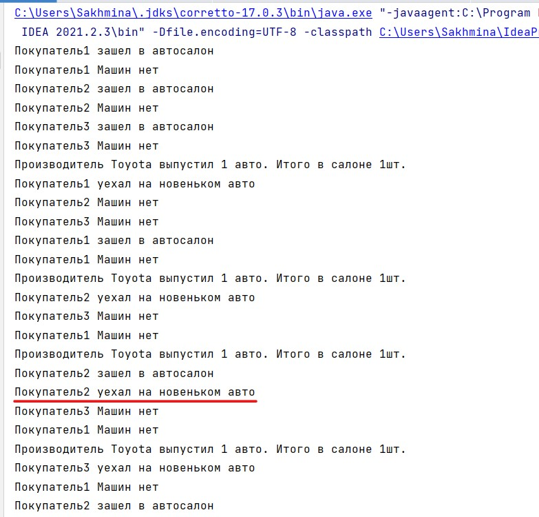

### 1.2 Работа с синхронизацией. Synchronized блоки. Методы wait, notify, sleep. Интерфейс lock.
## Задача 2. Продвинутый автосалон
Код по [ссылке](https://github.com/A-Sakhmina/netology_multithreading_carshop/tree/task2/src/main/java)
### Описание
У нас есть производитель товара (например, машин) и потребитель (покупатель). Покупатель хочет купить товар, 
но может это сделать только тогда, когда он есть в наличии (производитель его сделал/создал).

Объектом синхронизации является `Seller`.
### Работа программы
1. Создание потока-производителя и потока-покупателя
2. Покупатель покупает товар, если это возможно, в порядке **очереди**
3. С некоторой периодичностью производитель выкладывает товар на рынок

### Реализация
Модифицирован код предыдущей задачи([см. ветку master](https://github.com/A-Sakhmina/netology_multithreading_carshop)) 
таким образом, что используются не стандартные средства синхронизации, 
а только расширенные(`Lock`). 

Также соблюдается "честность" покупателей(используется реализация `ReentrantLock`).
Те, кто пришел за машиной первее - уезжают также не последними.

**Вывод**:
